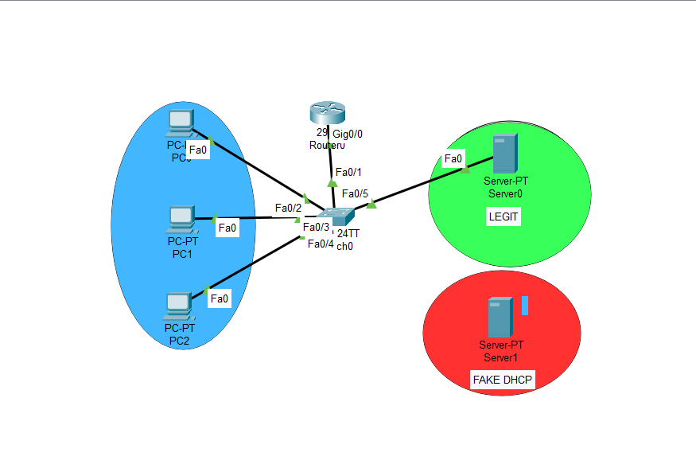
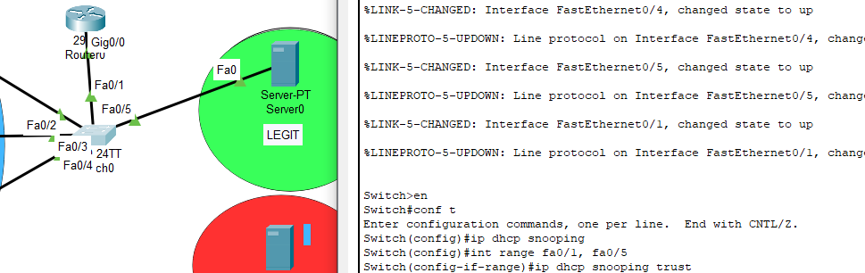
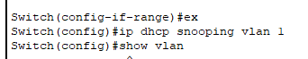

# DHCP Snooping Attack Prevention Lab

## Overview
This repository demonstrates DHCP Snooping configuration on Cisco switches to prevent rogue DHCP server attacks and DHCP-based network exploits. The lab showcases how to protect networks from unauthorized DHCP servers that can distribute malicious network configurations to clients.



## What is DHCP Snooping?

DHCP Snooping is a Layer 2 security feature that acts as a firewall between untrusted hosts and trusted DHCP servers. It performs the following functions:

1. **Validates DHCP messages** from untrusted sources
2. **Filters out invalid DHCP packets**
3. **Builds and maintains DHCP binding database**
4. **Rate-limits DHCP traffic** from untrusted sources
5. **Prevents rogue DHCP server attacks**

## Network Topology

The lab consists of:

### Blue Zone (Client Network)
- **PC0, PC1, PC2** - DHCP clients requesting IP addresses
- Connected to Switch (2960-24TT ch0) via Fa0 ports

### Green Zone (Legitimate DHCP Server)
- **Server0** - Legitimate DHCP server
- Label: **LEGIT**
- Connected via Fa0/1
- Configured as **trusted port**

### Red Zone (Rogue DHCP Server)
- **Server1** - Fake/Rogue DHCP server
- Label: **FAKE DHCP**
- Connected via Fa0/5
- Configured as **untrusted port** (blocked by DHCP Snooping)

### Core Router
- **Router0** (29xx Gig0/0)
- Connects switch to upstream network
- Connected via Fa0/2, Fa0/3, Fa0/4




## The Attack Scenario

### Without DHCP Snooping Protection:
1. Client PC broadcasts DHCP Discover
2. **Both legitimate and rogue DHCP servers respond**
3. Rogue server may respond faster
4. Client accepts rogue DHCP Offer
5. Client gets malicious configuration:
   - Wrong gateway (man-in-the-middle)
   - Wrong DNS (DNS poisoning)
   - Wrong subnet mask (denial of service)

### With DHCP Snooping Protection:
1. Client PC broadcasts DHCP Discover
2. Legitimate server (trusted port) responds ✅
3. Rogue server (untrusted port) response is **BLOCKED** ❌
4. Client receives only legitimate DHCP configuration
5. Network remains secure


## DHCP Snooping Configuration

### Basic Configuration

```cisco
! Enable DHCP Snooping globally
Switch(config)# ip dhcp snooping

! Enable DHCP Snooping for VLAN 1
Switch(config)# ip dhcp snooping vlan 1

! Configure trusted port (Legitimate DHCP Server)
Switch(config)# interface fa0/1
Switch(config-if)# ip dhcp snooping trust

! Configure trusted ports (Router uplinks)
Switch(config)# interface range fa0/2-4
Switch(config-if-range)# ip dhcp snooping trust

! Untrusted ports (clients and rogue server) - default
! Fa0/5 (rogue server) remains untrusted by default
! Client ports (Fa0/6-24) remain untrusted by default
```


### Advanced Configuration

```cisco
! Limit DHCP packets per second on untrusted ports
Switch(config)# interface range fa0/6-24
Switch(config-if-range)# ip dhcp snooping limit rate 10

! Enable Option 82 (DHCP Relay Agent Information)
Switch(config)# ip dhcp snooping information option

! Verify DHCP Snooping database
Switch(config)# ip dhcp snooping database flash:/dhcp-snooping.db

! Save configuration
Switch(config)# do write memory
```

## Port Trust Configuration

### Trusted Ports (Allow DHCP Server Responses)
- **Fa0/1** - Legitimate DHCP Server (Server0 - LEGIT)
- **Fa0/2, Fa0/3, Fa0/4** - Router uplinks
- Trusted ports can send DHCP Offer, DHCP Ack messages

### Untrusted Ports (Block DHCP Server Responses)
- **Fa0/5** - Rogue DHCP Server (Server1 - FAKE DHCP) ❌
- **Fa0/6-24** - Client ports
- Untrusted ports can only send DHCP Discover, DHCP Request messages
- DHCP Offer and DHCP Ack from untrusted ports are **dropped**

## DHCP Snooping Binding Database

DHCP Snooping maintains a binding table with:
- **MAC Address** - Client's MAC address
- **IP Address** - Assigned IP address  
- **VLAN** - VLAN number
- **Interface** - Switch port
- **Lease Time** - DHCP lease duration

```cisco
Switch# show ip dhcp snooping binding
MacAddress          IpAddress        Lease(sec)  Type           VLAN  Interface
------------------  ---------------  ----------  -------------  ----  --------------------
00:0C:29:A1:B2:C3   192.168.1.10     86400       dhcp-snooping   1    FastEthernet0/6
00:0C:29:D4:E5:F6   192.168.1.11     86400       dhcp-snooping   1    FastEthernet0/7
```

This database is used by other security features:
- **Dynamic ARP Inspection (DAI)**
- **IP Source Guard**

## Verification Commands

### Check DHCP Snooping Status
```cisco
Switch# show ip dhcp snooping
Switch DHCP snooping is enabled
DHCP snooping is configured on following VLANs:
1
DHCP snooping is operational on following VLANs:
1
Insertion of option 82 is enabled
Interface                  Trusted    Rate limit (pps)
-----------------------    -------    ----------------
FastEthernet0/1            yes        unlimited
FastEthernet0/2            yes        unlimited
FastEthernet0/3            yes        unlimited
FastEthernet0/4            yes        unlimited
FastEthernet0/5            no         unlimited
```

### Check DHCP Binding Table
```cisco
Switch# show ip dhcp snooping binding
```

### Check DHCP Statistics
```cisco
Switch# show ip dhcp snooping statistics
```

### Debug DHCP Snooping
```cisco
Switch# debug ip dhcp snooping packet
Switch# debug ip dhcp snooping event
```


## Attack Prevention Mechanisms

### 1. Rogue DHCP Server Attack
**Attack**: Attacker sets up unauthorized DHCP server
**Prevention**: DHCP Snooping blocks DHCP responses from untrusted ports

### 2. DHCP Starvation Attack
**Attack**: Attacker floods network with DHCP requests to exhaust IP pool
**Prevention**: Rate limiting on untrusted ports (`ip dhcp snooping limit rate`)

### 3. Man-in-the-Middle Attack
**Attack**: Rogue DHCP provides attacker's IP as default gateway
**Prevention**: Only trusted DHCP server can assign gateway

### 4. DNS Poisoning via DHCP
**Attack**: Rogue DHCP provides malicious DNS servers
**Prevention**: Clients only accept DNS from legitimate DHCP server

## Integration with Other Security Features

### DHCP Snooping + DAI (Dynamic ARP Inspection)
```cisco
! Enable DAI
Switch(config)# ip arp inspection vlan 1

! Configure DAI trusted ports
Switch(config)# interface range fa0/1-4
Switch(config-if-range)# ip arp inspection trust

! DAI uses DHCP Snooping binding table to validate ARP packets
```

### DHCP Snooping + IP Source Guard
```cisco
! Enable IP Source Guard
Switch(config)# interface range fa0/6-24
Switch(config-if-range)# ip verify source

! Prevents IP spoofing using DHCP Snooping binding table
```

### DHCP Snooping + Port Security
```cisco
! Combine with Port Security for maximum protection
Switch(config)# interface range fa0/6-24
Switch(config-if-range)# switchport port-security
Switch(config-if-range)# switchport port-security maximum 2
Switch(config-if-range)# switchport port-security violation restrict
```

## Testing the Configuration

### Test 1: Legitimate DHCP Server (Should Work)
```
PC0> dhcp
DDORA IP 192.168.1.10/24 GW 192.168.1.1
```
✅ **Result**: PC receives IP from legitimate server (Server0)

### Test 2: Rogue DHCP Server (Should Fail)
```
PC1> dhcp
DHCP request timeout
```
❌ **Result**: DHCP response from Server1 (FAKE DHCP) is blocked

### Test 3: Verify Snooping Database
```cisco
Switch# show ip dhcp snooping binding
! Should show bindings only from legitimate server
```

## Configuration Examples

### Complete Switch Configuration
```cisco
! Hostname
Switch(config)# hostname ch0

! Enable DHCP Snooping
Switch(config)# ip dhcp snooping
Switch(config)# ip dhcp snooping vlan 1

! Configure trusted ports (Legitimate DHCP + Router)
Switch(config)# interface fa0/1
Switch(config-if)# description LEGITIMATE-DHCP-SERVER
Switch(config-if)# ip dhcp snooping trust
Switch(config-if)# exit

Switch(config)# interface range fa0/2-4
Switch(config-if-range)# description ROUTER-UPLINKS
Switch(config-if-range)# ip dhcp snooping trust
Switch(config-if-range)# exit

! Configure untrusted ports with rate limiting
Switch(config)# interface fa0/5
Switch(config-if)# description ROGUE-DHCP-BLOCKED
Switch(config-if)# ip dhcp snooping limit rate 10
Switch(config-if)# exit

Switch(config)# interface range fa0/6-24
Switch(config-if-range)# description CLIENT-PORTS
Switch(config-if-range)# ip dhcp snooping limit rate 10
Switch(config-if-range)# exit

! Save configuration
Switch(config)# exit
Switch# write memory
```

## Common Issues and Troubleshooting

### Issue 1: Legitimate Server Blocked
**Symptom**: Clients not getting IP addresses
**Solution**: Verify server port is configured as trusted
```cisco
Switch(config)# interface fa0/1
Switch(config-if)# ip dhcp snooping trust
```

### Issue 2: DHCP Snooping Not Working
**Symptom**: Rogue server still responding
**Solution**: Enable DHCP Snooping on correct VLAN
```cisco
Switch(config)# ip dhcp snooping vlan 1
```

### Issue 3: Option 82 Causing Issues
**Symptom**: DHCP relay not working
**Solution**: Disable Option 82 if not needed
```cisco
Switch(config)# no ip dhcp snooping information option
```

### Issue 4: Binding Database Full
**Symptom**: New clients cannot get IP
**Solution**: Clear old bindings or increase database size
```cisco
Switch# clear ip dhcp snooping binding
```

## Best Practices

✅ **Always Configure These:**
1. Enable DHCP Snooping globally and per VLAN
2. Set legitimate DHCP server ports as trusted
3. Set router/gateway ports as trusted
4. Keep all client ports as untrusted (default)
5. Enable rate limiting on untrusted ports
6. Save binding database to flash

✅ **Security Recommendations:**
- Combine with DAI and IP Source Guard for layered security
- Monitor DHCP Snooping statistics regularly
- Keep binding database backed up
- Document all trusted ports
- Audit trust configuration periodically

❌ **Never Do This:**
- Trust client ports
- Forget to enable on VLANs
- Set rogue server port as trusted
- Disable DHCP Snooping in production without planning

## Repository Structure
```
.
├── assets/
│   ├── dhcp-snooping-topology.png
│   ├── snooping-config.png
│   ├── attack-scenario.png
│   ├── config-steps.png
│   └── verification.png
├── configs/
│   ├── switch-dhcp-snooping.txt
│   ├── legitimate-server-config.txt
│   └── complete-security-config.txt
├── documentation/
│   ├── dhcp-snooping-guide.pdf
│   └── security-policy.pdf
└── README.md
```

## Security Impact

### Without DHCP Snooping:
- ❌ Rogue DHCP servers can operate freely
- ❌ Man-in-the-middle attacks possible
- ❌ DNS poisoning via DHCP
- ❌ Network reconnaissance easier
- ❌ DHCP starvation attacks effective

### With DHCP Snooping:
- ✅ Only authorized DHCP servers work
- ✅ DHCP-based attacks prevented
- ✅ Binding database for other security features
- ✅ Network integrity maintained
- ✅ Foundation for DAI and IP Source Guard

## Learning Objectives

This lab demonstrates:
1. Understanding DHCP security vulnerabilities
2. Configuring DHCP Snooping on Cisco switches
3. Distinguishing between trusted and untrusted ports
4. Preventing rogue DHCP server attacks
5. Building DHCP Snooping binding database
6. Integrating with other Layer 2 security features
7. Troubleshooting DHCP Snooping issues
8. Implementing defense-in-depth security

## Related Security Features

- **Dynamic ARP Inspection (DAI)** - Prevents ARP spoofing
- **IP Source Guard** - Prevents IP address spoofing
- **Port Security** - Limits MAC addresses per port
- **802.1X** - Network access control
- **Private VLANs** - Layer 2 isolation

## Lab Environment

- **Platform**: Cisco Packet Tracer / GNS3
- **Switch**: Cisco Catalyst 2960 (ch0)
- **Router**: Cisco 2911/2901
- **Legitimate Server**: Server0 (LEGIT)
- **Rogue Server**: Server1 (FAKE DHCP)
- **Clients**: PC0, PC1, PC2

## Getting Started

1. Review the network topology
2. Understand the attack scenario
3. Configure DHCP Snooping step-by-step
4. Test with legitimate DHCP server
5. Verify rogue server is blocked
6. Check DHCP Snooping binding table
7. Integrate with DAI and IP Source Guard

## Additional Resources

- Cisco DHCP Snooping Configuration Guide
- Layer 2 Security Best Practices
- DHCP Attack Mitigation Strategies
- Network Security Fundamentals

## License
Educational/Training purposes

---
*This lab demonstrates essential Layer 2 security practices for protecting DHCP infrastructure in enterprise networks.*
